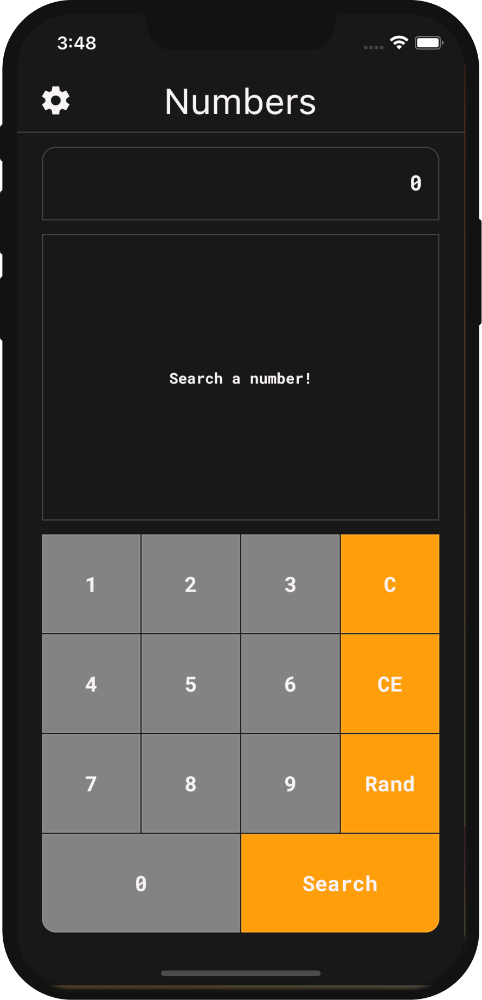
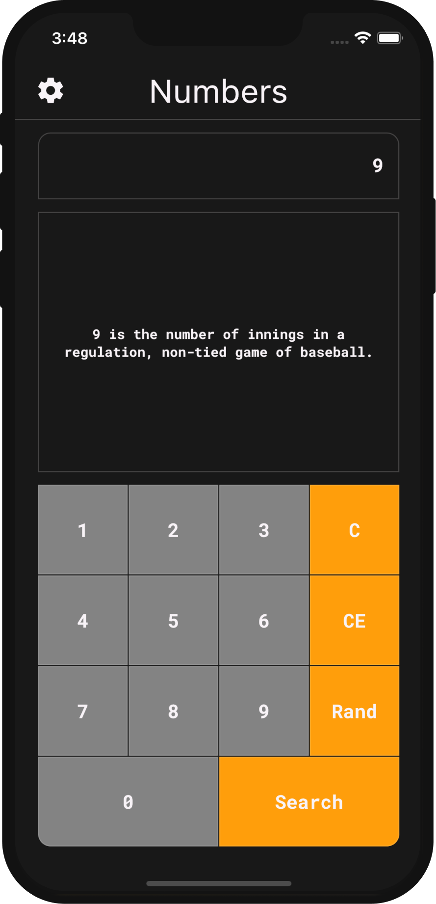
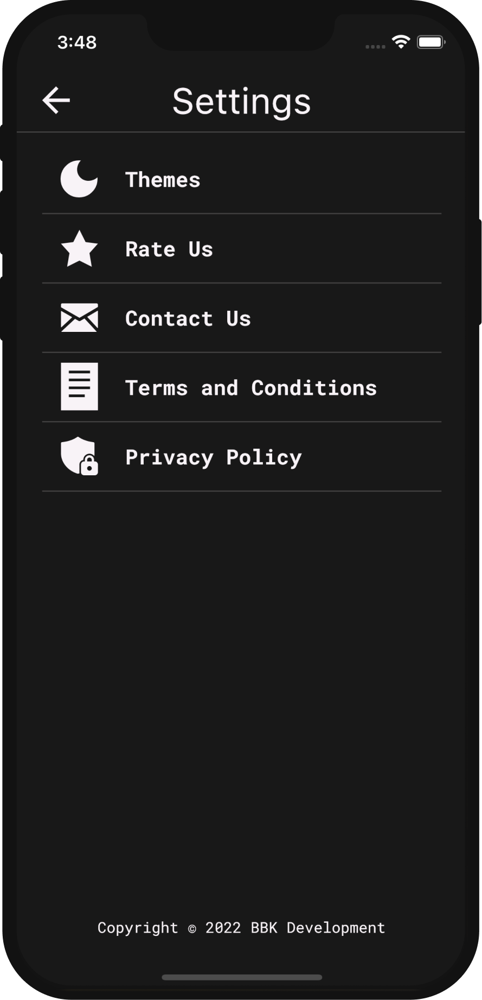
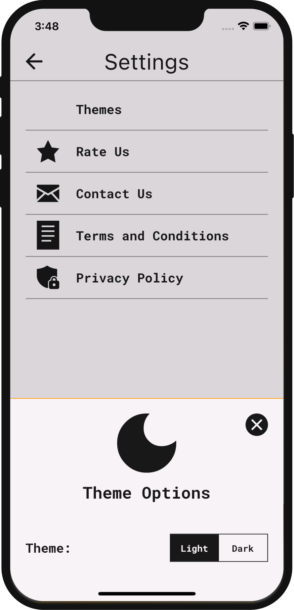
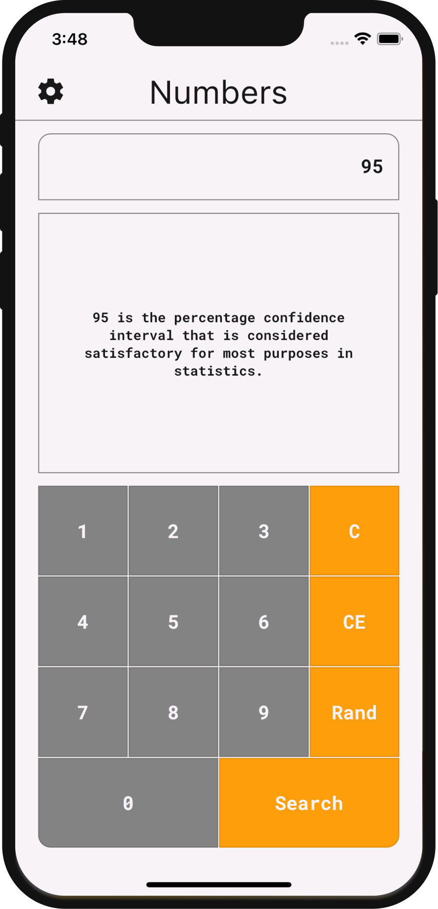

# 
Numbers

An app that shows interesting information about the searched number. In addition, it is also possible to search for a random number and see interesting facts about that number as well. If you are curious about the API which provides this info about the numbers, take a look at: http://numbersapi.com

Keeping code `clean` and `tested` are the two most important development practices. In Flutter, this is even more true than with other frameworks. Therefore, even `state management` patterns like `BLoC` are not sufficient in themselves to allow for an easily extendable codebase.

As proposed by `Uncle Bob`, we should all strive to separate code into independent layers and depend on abstractions instead of concrete implementations.

For this purpose, in this project, applied `clean architecture`. The project has been written solely in Dart language.

&nbsp;

State Management: `flutter_bloc`

Dependency Injection: `get_it`

HTTP Client: `dio`

Simple Storage: `shared_preferences`

Router: `go_router`

Test: `mocktail`

&nbsp;

### Screenshots of the app:

&nbsp; &nbsp; &nbsp; &nbsp; &nbsp;

&nbsp;

&nbsp; &nbsp; &nbsp; &nbsp; &nbsp;

&nbsp;

