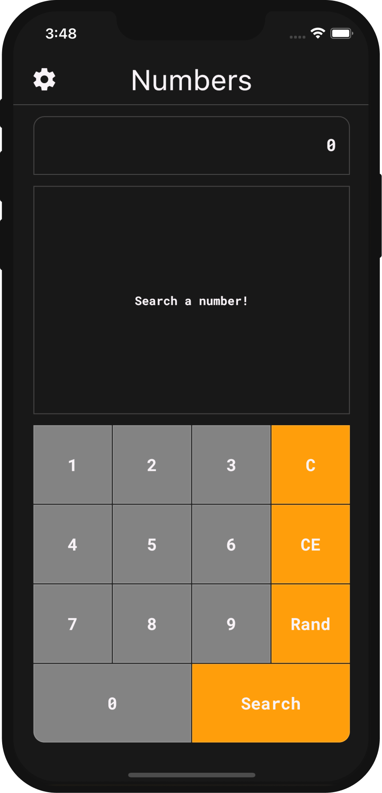

# 
Numbers

An app that shows interesting information about any specific number that searched. In addition, it is possible to search for a random number and see interesting facts about that number as well.

Keeping code `clean` and `tested` are the two most important development practices. In Flutter, this is even more true than with other frameworks. Therefore, even `state management` patterns like `BLoC` are not sufficient in themselves to allow for an easily extendable codebase.

As proposed by `Uncle Bob`, we should all strive to separate code into independent layers and depend on abstractions instead of concrete implementations.

For this purpose, in this project, applied `clean architecture`. The project has been written solely in Dart Language.

### Screenshots of the app:

&nbsp; &nbsp; &nbsp; &nbsp; &nbsp;

&nbsp;

&nbsp; &nbsp; &nbsp; &nbsp; &nbsp;

